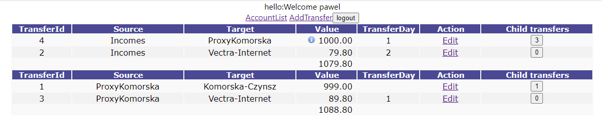

<!--Category:C#,SQL--> 
 <p align="right">
    <a href="http://productivitytools.tech/productivitytools-createsqlserverdatabase/"><a> 
    <a href="https://github.com/ProductivityTools-Learning/ProductivityTools.Example.GCP.SecretManager"></a>
</p>
<p align="center">
    <a href="http://http://productivitytools.top/">
        
    </a>
</p>

# Transfers Api

Application exposes methods for transfers web

<!---more--->

Validate of the service can be done with:

```http://192.168.0.52:8090/Transfer/echo?name=pawel"```
```http://apitransfers.productivitytools.top:80/Transfer/echo?name=pawel```

